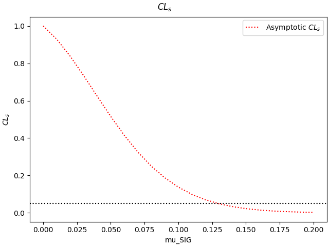
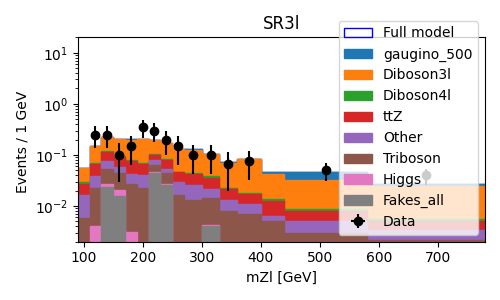

Setting limits from a converted ATLAS pyhf model 
--------------------------------------------------

This tutorial covers the use-case of working from a full likelihood published as a pyhf model. The model is the one taken from
`this hepdata entry <https://www.hepdata.net/record/ins1831992>`_, describing the search for new supersymmetric particles in a trilepton
final state. The same example is described in Section 3 of Ref. [SLLS]_.

The tutorial has 5 main steps :

* Setting up the package

* Obtaining the full likelihood

* Converting the full likelihood to the simplified format

* Performing limit computations

* Plotting results

Setting up
##########
.. _setting-up:

The package can be installed and set up by running

.. code-block:: console

  git clone ssh://git@gitlab.cern.ch:7999/nberger/fastprof.git
  cd fastprof/
  source ./setup.sh

and we will run this tutorial in the ``run/`` working directory:

.. code-block:: console

   cd run/

and for convenience we'll link the tutorial inputs from here: 

.. code-block:: console

   ln -s ../doc/tutorials/ATLAS_SUSY_trileptons/inputs

Obtaining the full likelihood
#############################

This step requires a working installation of `pyhf <https://github.com/scikit-hep/pyhf>`_, which can be obtained by following the instructions on `this page <https://pyhf.github.io/pyhf-tutorial/introduction.html>`_. In case a pyhf installation is not available, one can proceed to the next step using the file ``brZ_60_brH_20_brW_20_bre_33_brm_33_brt_33_mass_500.json`` that is available in ``inputs/``.

Please make sure this step is performed in a separate session from the
one in the previous step, as setting up the pyhf environment will interfere with the fastprof setup.

This tutorial will use a SUSY model parameter point corresponding to
- A gaugino mass of 500 GeV
- Gaugino branching ratios to H/Z/W of 60/20/20
- Equal branching ratios to all 3 lepton flavors for the accompanying lepton.

The commands to obtain the model using pyhf are

.. code-block:: console

   curl -OJLH "Accept: application/x-tar" https://doi.org/10.17182/hepdata.99806.v2/r2
   
   tar zxvf FullLikelihoods_sm.tar.gz
   
   jsonpatch inclusive_bkgonly.json <(pyhf patchset extract inclusive_patchset.json \
   --name "brZ_60_brH_20_brW_20_bre_33_brm_33_brt_33_mass_500") \
   >! brZ_60_brH_20_brW_20_bre_33_brm_33_brt_33_mass_500.json

If all goes well, a file named ``brZ_60_brH_20_brW_20_bre_33_brm_33_brt_33_mass_500.json`` should have been created. It contains the full likelihood for this measurement point, in the pyhf JSON format

Simplified likelihood conversion
################################

The next step is the conversion of the pyhf likelihood to a simplified likelihood. For this, please make sure you are back to the fastprof session defined in :ref:`Setting up <setting-up>` above.

One starts from the ``brZ_60_brH_20_brW_20_bre_33_brm_33_brt_33_mass_500.json`` file that has either been produced at the previous step or taken from ``inputs/``. Conversion to the simplified likleihood is performed using a dedicated fastprof script:

.. code-block:: console

  convert_pyhf_json.py -o trileptons.json brZ_60_brH_20_brW_20_bre_33_brm_33_brt_33_mass_500.json

The script should produce a long list of warnings concerning same-sign +1 and -1 sigma impacts. This occurs when the positive and negative variations of an NP both move the event yield in the same direction for a particular bin. This can be due to non-linear NP impacts or quirks of the input model and can safely ignored if the effects are not large, as is the case here.

If all goes well, the script should produce a file ``trileptons.json`` containing the fastprof specification of the simplified likelihood.

Performing limit computations
#############################

The model contains a single parameter of interest ``mu_SIG``, that corresponds to the signal yield relative to the model expectation (here for the model with a 500 GeV gaugino, as described above). The first order of business is to produce a profile likelihood scan of this parameter, using the command below:

.. code-block:: console

  python -i poi_scan.py -m paper/models/trileptons.json -y mu_SIG=-0.01:0.20:22+ \
  -o scan_trileptons

This scans values of ``mu_SIG`` from -0.01 to 0.20 in 22 steps. The '+' at the end specifies that the endpoint (0.20 here) should be included in the scan.The ``python -i`` prefix opens an interactive python session so that the plot remains visible -- close it when ``exit`` when done. (one can also run just ``poi_scan.py`` without the prefix to avoid this).

The scan should be as follows:

and the 68% CL interval on ``mu_SIG`` should be printed out as::

  mu_SIG = 0.044474 +0.0444334 -0.0343663 @ 68.3% CL

Finally, one can also compute a 95% CL upper limit on ``mu_SIG``. The command is

.. code-block:: console

  python -i compute_fast_limits.py -m trileptons.json -y mu_SIG=0:0.20:21+ -o limit_trileptons

This should yield a CLs limit of 0.126255, which indicates that for these model parameters, the model prediction ``mu_SIG=1`` is excluded at the 95% level. The plot below giving the CLs p-value as a function of ``mu_SIG`` should also be displayed.

Both of these results are computed in the asymptotic approximation, i.e. assuming Gaussian behavior of the profile likelihood ratio.

Plotting results
################

The aim of this section is to plot the model predictions and data. The model includes 3 signal regions (SRs), each containing 16 bins of the invariant mass variable :math:`m_{Zl}`, and 3 control regions (CRs) with a single bin apiece. Making the relevant plots is not completely trivial since the model is stored as a collection of unrelated bins, so that the SRs need to be pieced back together as a consistent range of bins. This is done using the following script:

.. code-block:: console

   merge_channels.py -m trileptons.json -d trileptons.json \
   -o trileptons_merged --obs-name mZl --obs-unit GeV -c "\
   SRFR=\
       SRFR_90_110_all_cuts:90:110,
       SRFR_110_130_all_cuts:110:130,
       SRFR_130_150_all_cuts:130:150,
       SRFR_150_170_all_cuts:150:170,
       SRFR_170_190_all_cuts:170:190,
       SRFR_190_210_all_cuts:190:210,
       SRFR_210_230_all_cuts:210:230,
       SRFR_230_250_all_cuts:230:250,
       SRFR_250_270_all_cuts:250:270,
       SRFR_270_300_all_cuts:270:300,
       SRFR_300_330_all_cuts:300:330,
       SRFR_330_360_all_cuts:330:360,
       SRFR_360_400_all_cuts:360:400,
       SRFR_400_440_all_cuts:400:440,
       SRFR_440_580_all_cuts:440:580,
       SRFR_580_inf_all_cuts:580:780~
     SR4l=\
       SR4l_90_110_all_cuts:90:110,
       SR4l_110_130_all_cuts:110:130,
       SR4l_130_150_all_cuts:130:150,
       SR4l_150_170_all_cuts:150:170,
       SR4l_170_190_all_cuts:170:190,
       SR4l_190_210_all_cuts:190:210,
       SR4l_210_230_all_cuts:210:230,
       SR4l_230_250_all_cuts:230:250,
       SR4l_250_270_all_cuts:250:270,
       SR4l_270_300_all_cuts:270:300,
       SR4l_300_330_all_cuts:300:330,
       SR4l_330_360_all_cuts:330:360,
       SR4l_360_400_all_cuts:360:400,
       SR4l_400_440_all_cuts:400:440,
       SR4l_440_580_all_cuts:440:580,
       SR4l_580_inf_all_cuts:580:780~
     SR3l=\
       SR3l_90_110_all_cuts:90:110,
       SR3l_110_130_all_cuts:110:130,
       SR3l_130_150_all_cuts:130:150,
       SR3l_150_170_all_cuts:150:170,
       SR3l_170_190_all_cuts:170:190,
       SR3l_190_210_all_cuts:190:210,
       SR3l_210_230_all_cuts:210:230,
       SR3l_230_250_all_cuts:230:250,
       SR3l_250_270_all_cuts:250:270,
       SR3l_270_300_all_cuts:270:300,
       SR3l_300_330_all_cuts:300:330,
       SR3l_330_360_all_cuts:330:360,
       SR3l_360_400_all_cuts:360:400,
       SR3l_400_440_all_cuts:400:440,
       SR3l_440_580_all_cuts:440:580,
       SR3l_580_inf_all_cuts:580:780"

The command builds new model channels by merging the existing single-bin channels in the specified order. The other channels (here the CRs) are not affected. The merged channels are `binned_range` channels, corresponding to a binning in a continuus observable. The name and unit of the observable (used e.g. in the plots below) is specified using ``--obs-name`` and ``--obs-unit``.

The command should produce two files ``trileptons_merged.json`` and ``trileptons_merged_data.json`` containing the new model and the associated data. the data and model predictions in each regions can be plotted using:

.. code-block:: console

   plot.py -m trileptons_merged.json -d trileptons_merged_data.json -w 5x3 -y 2E-3,20 --profile \
   --setval mu_SIG=0.044 --stack --log-scale --bin-width 1 -o trileptons_SR4l.png --channel SR4l
   
   plot.py -m trileptons_merged.json -d trileptons_merged_data.json -w 5x3 -y 2E-3,20 --profile \
   --setval mu_SIG=0.044 --stack --log-scale --bin-width 1 -o trileptons_SR3l.png --channel SR3l
   
   plot.py -m trileptons_merged.json -d trileptons_merged_data.json -w 5x3 -y 1E-4,20 --profile \
   --setval mu_SIG=0.044 --stack --log-scale --bin-width 1 -o trileptons_SRFR.png --channel SRFR
   
   plot.py -m trileptons_merged.json -d trileptons_merged_data.json -w 5x2.7 --no-legend --profile \
   --setval mu_SIG=0.044 --stack --log-scale --bin-width 1 -o trileptons_CRs.png \
   --channel CRWZ_all_cuts,CRZZ_all_cuts,CRttZ_all_cuts

The arguments are as follows: 
   - ``--setval mu_SIG=0.044`` defines the signal normalization (here close to the best-fit value computed above)
   - ``--channel`` specifies which channels to plot. If multiple values are given (as here for the CRs), the figure will be split into subplots.
   - ``--stacked`` specifies that the background and signal histograms should be stacked.
   - ``--profile`` specifies that the NPs should be set to their profiled values when evaluating the expected yields.
   - ``-y`` sets the y range.
   - ``--log-scale`` specifies a logarithmic scale for the y-axis.
   - ``--bin-width 1`` specifies that the bin contents should be scaled to events per 1 GeV.
   - ``-w`` parameter specifies the figure size (here 5x3 cm).
   
The commands should produce the plots below:

.. [SLLS] N. Berger *Simplified likelihoods using linearized systematic uncertainties* `arXiv:2301.05676 <https://arxiv.org/abs/2301.05676>`_
