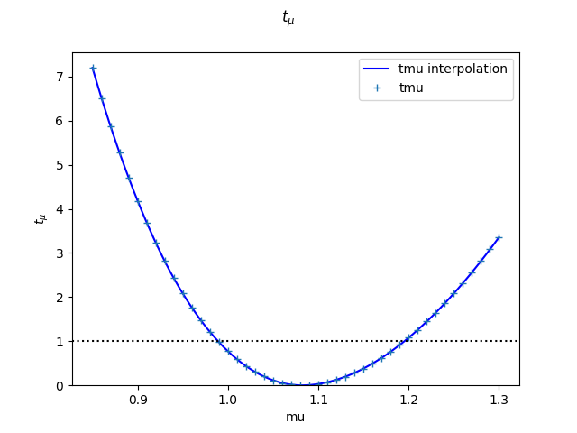
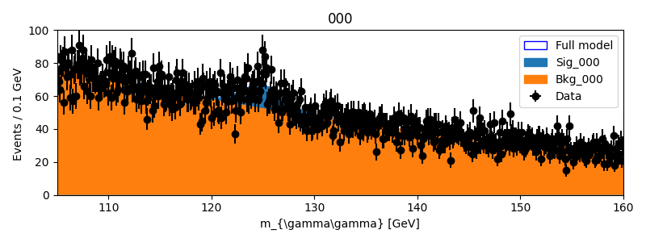
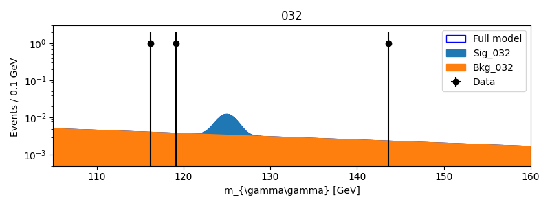
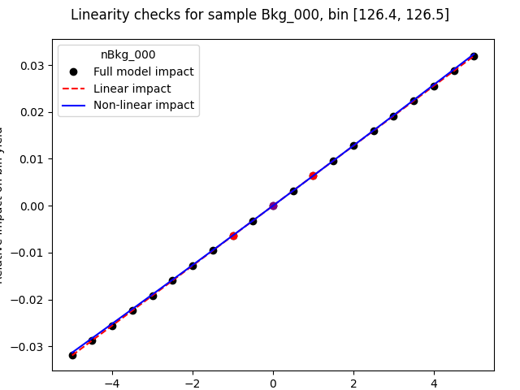
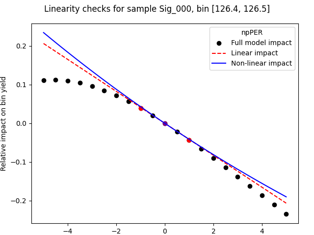

Simplified likelihood for a semi-realistic :math:`H\rightarrow\gamma\gamma` analysis
------------------------------------------------------------------------------------

This tutorial presents the usecase of simplified likelihoods applied to an unbinned analysis. The measurement is taken from Ref. [Hyy]_, considering only the first 33 categories which target the :math:`gg \rightarrow H` production process. The analysis is simplified for this
example case: the signal and background distributions of the :math:`m_{\gamma\gamma}` observable use simple Gaussian and Exponential distributions, repsectively, and a limited set of systematic uncertainties are considered. The same example is described in Section 4 of Ref. [SLLS]_, where more details about the model can also be found.

The tutorial has 5 main steps :

* Setting up the package

* Converting the full likelihood to the simplified format

* Performing a measurement of the Higgs signal strength

* Plotting distributions

* Validating the model

Setting up
##########
.. _setting-up:

The package can be installed and set up by running

.. code-block:: console

  git clone ssh://git@gitlab.cern.ch:7999/nberger/fastprof.git
  cd fastprof/
  source ./setup.sh

and we will run this tutorial in the ``run/`` working directory:

.. code-block:: console

   cd run/

and for convenience we'll link the tutorial inputs from here: 

.. code-block:: console

   ln -s ../doc/tutorials/Hyy_like_analysis/inputs
   

Simplified likelihood conversion
################################

The full likelihood of the measurement is stored in a ROOT workspace available in ``inputs/Hyy.root``. The conversion to a simplified likelihood is performed using an automatic conversion tool distributed within fastprof. The script requires a ROOT installation, in order to be able to read the ROOT file. In particular, one should be able to use ROOT within a fastprof python session using the ``import ROOT`` command. The installation should also include the `roofit` module used for unbinned models. If this requirement is met, the conversion can be performed using

.. code-block:: console

  convert_ws.py -f inputs/Hyy.root -w combWS -d obsData -m ModelConfig \
  -b 105:160:551+ -t 1E-3 -o Hyy33.json >! log_Hyy33.txt

The arguments are as follows:
- ``-f`` specifies the input file.
- ``-w`` specifies the name of the workspace within the file.
- ``-d`` specifies the name of the dataset to use.
- ``-m`` provides the name of the RooStats ``ModelConfig`` object holding the model description.
- ``-b`` specifies the binning to use. Here one asks for 551 bins between 105 and 160 GeV. The ``+`` indicates that the endpoint at 160 GeV should be included in the binning.
- ``-t`` provides the packing tolerance, i.e. the relative difference below which the numerical values of parameter impacts are considered negligible. This allows to reduce the size of the output file by providing impacts for groups of bins with similar impacts.
- ``-o`` The output file, containing both the model and the dataset.

The output file ``Hyy33.json`` can also be found in the ``inputs/`` directory, in case ROOT is not available.

Performing a measurement of the Higgs signal strength
#####################################################

The model contains a single parameter of interest ``mu``, the signal yield for the Higgs signal yield relative to the Standard Model expectation.
A profile likelihood scan for ``mu`` is performed using

.. code-block:: console

  python -i poi_scan.py -m Hyy33.json \
  -y mu=0.85:1.3:46+ -o scan_Hyy -x

The options for the scan are described in more detail in the previous tutorials. Here the scan is performed
over :math:`0.85 < \mu < 1.3` in 46 steps, with both endpoints included, so that the step size is 0.1. The ``-x`` option
indicates that the command should overwrite previous outputs if it is re-run.

The scan should look like in the image below:

and the 68% CL interval on ``mu`` should be printed out as::

   mu = 1.08193 +0.113326 -0.0928664 @ 68.3% CL

One can go a bit further by removing some of the uncertainties to check their impacts on the total uncertainty on ``mu``. One can
start with the photon energy resolution uncertainty, which is expected to be dominant. The corresponding nuisance parameter (NP) is ``npPER``, and the uncertainty can be deactivated by pruning away this NP:

.. code-block:: console

  prune_model.py -m Hyy33.json  -d Hyy33.json \
  -o Hyy33_noPER.json -p npPER=0.2159

The command creates a new model in ``Hyy33_noPER.json`` where ``npPER`` is fixed to the value 0.2159. This is the best-fit value of ``npPER`` in the fit to data with free ``mu``, and setting this ensures that the best-fit value of ``mu`` in the new model remains the same as in the original one. The best-fit values can be found in the ``scan_Hyy_raster.json`` file that was produced when computing the profile likelihood scan above, and contains the best-fit values of all the parameters.

One can then obtain the uncertainty without the photon energy resolution contribution by running
  
.. code-block:: console

  python -i poi_scan.py -m Hyy33_noPER.json \
  -y mu=0.85:1.3:46+ -o scan_Hyy_noPER -x

This yields::

  mu = 1.08237 +0.110382 -0.0896623 @ 68.3% CL

with a slightly small uncertainty as expected.

One can also compute the statistical uncertainty alone by fixing all the NPs:

.. code-block:: console

    prune_model.py -m Hyy33.json -d Hyy33.json -o Hyy33_noSyst.json \
    -p npLUM=0.0023,npGGF=0.0064,npUPS=0.0058,npPER=0.2159,\
    npEFF=0.0035,npModel_000=-0.0534,npModel_001=0.1857,\
    npModel_002=0.0342,npModel_003=-0.0657,npModel_004=-0.0476,\
    npModel_005=-0.1046,npModel_006=0.0039,npModel_007=-0.0083,\
    npModel_008=0.0093,npModel_009=-0.0090,npModel_010=-0.0672,\
    npModel_011=0.0081,npModel_012=0.0185,npModel_013=-0.0009,\
    npModel_014=-0.0065,npModel_015=0.0007,npModel_016=-0.0013,\
    npModel_017=0.0079,npModel_018=0.0014,npModel_019=0.0146,\
    npModel_020=0.0045,npModel_021=0.0007,npModel_022=-0.0010,\
    npModel_023=-0.0062,npModel_024=0.0006,npModel_025=-0.0025,\
    npModel_026=-0.0002,npModel_027=-0.0000,npModel_028=-0.0014,\
    npModel_029=0.0002,npModel_030=0.0003,npModel_031=0.0020,\
    npModel_032=-0.0002

    python -i poi_scan.py -m Hyy33_noSyst.json \
    -y mu=0.85:1.3:46+ -o scan_Hyy_noSyst -x

Specifying all the NP values is tedious, but the arguments can be automaticall generated by parsing ``scan_Hyy_raster.json``. The scan should yield::

  mu = 1.08207 +0.0446902 -0.0444285 @ 68.3% CL

which shows the stat-only uncertainty. This is nicely symmetric and much smaller than the total uncertainty, which shows that the measurement is dominated by systematic uncertainties.
   
All of these results are computed in the asymptotic approximation, i.e. assuming Gaussian behavior of the profile likelihood ratio.

Plotting distributions
######################

The model includes 33 signal regions, each containing 551 bins of the invariant mass variable :math:`m_{\gamma\gamma}`. The data and model predictions in each regions can be plotted using:

.. code-block:: console

  plot.py -m Hyy33.json -w 8x3 -y 0,100 --profile --setval mu=1.08 \
  --channel 000 --stack --bin-width 0.1 -o Hyy_000.png

  plot.py -m Hyy33.json -w 8x3 -y 5E-4,3 --profile --setval mu=1.08 \
  --channel 032 --stack --log-scale --bin-width 0.1 -o Hyy_032.png

The arguments are described in detail in previous tutorials.

The commands should produce the plots below:

Validating the model
####################

Simplified models should be carefully validated against full models to ensure that they provide a sufficiently accurate
description. In the case of linearized models, an important check is to verify that the NP impacts are sufficiently
linear. The fastprof package provides tools for this check, in particular to compare the linear impacts with the exact
values. These exact values can be stored in a separate `validation` file that is generated together with the model
conversion. This can be requested using the ``-l`` argument to ``convert_ws.py``, followed by a file name :

.. code-block:: console

  convert_ws.py -f inputs/Hyy.root -w combWS -d obsData -m ModelConfig -b 105:160:551+ \
  -t 1E-3 -o Hyy33.json -l Hyy33_valid.json >! log_Hyy33_valid.txt

The command takes much longer to run than a simple conversion, and the validation file is quite large (here 110MB).

Once it is produced, the linear (or not) behavior of the NP impacts can be checked using the ``plot_valid.py`` utility.

As an example, we plot the impact of the ``nBkg_000`` parameter, which gives the normalization of the background in the first
category. This has a linear impact on all bin yields by construction, so we expect linear behavior. The plot command is

.. code-block:: console

  plot_valid.py -m Hyy33.json -l Hyy33_valid.json --symmetric \
  -c 000 -s Bkg_000 -p nBkg_000 -b 214 -o nBkg_Bkg000_214.png

- ``-m`` and ``-l`` specify the model and validation data files. 
- ``--symmetric`` requests only symmetric impacts, without consideration of possible asymmetric uncertainties.
- ``-c`` provides the channel (or category) name, here 000.
- ``-s`` provides the name of the sample for which to plot the impacts (here Background, in category 000)
- ``-b`` provides the bin number. Bin 214 here is at 126.4 - 126.5 GeV, about :math:`0.7\sigma` above the signal peak.
  

As expected, everything is quite linear.

As an example of non-linear behavior, one can study the ``npPER`` nuisance parameter, which is associated with the photon energy resolution systematic. The systematic changes the width of the signal peak, and changes in the NP are therefore expected to have strong and highly non-linear impacts on the expected yield of bins near the peak. This can be checked by running

.. code-block:: console

  plot_valid.py -m Hyy33.json -l Hyy33_valid.json --symmetric \
   -c 000 -s Sig_000 -p npPER -b 214 -o PER_Sig000_214.png

which looks at the same bin as before, but now in the signal sample (since this is where ``npPER`` has an impact). This gives the following output:

The impact is highly non-linear, again as expected. However for small values of the NP the approximation is sufficiently good that this does not have a large effect on the measurement of ``mu``.
    
.. [Hyy] ATLAS Collaboration, *Measurement of the properties of Higgs boson production at √s = 13 TeV in the H → γγ channel using 139 fb−1 of pp collision data with the ATLAS experiment*, 2022. `arXiv:2207.00348 <https://arxiv.org/abs/2207.00348>`_

.. 
   [SLLS] N. Berger *Simplified likelihoods using linearized systematic uncertainties* `arXiv:2301.05676 <https://arxiv.org/abs/2301.05676>`_
