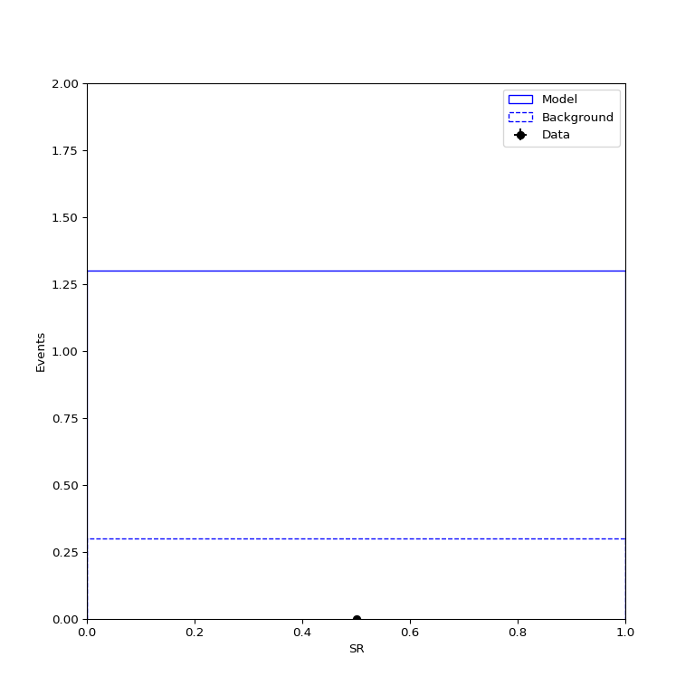
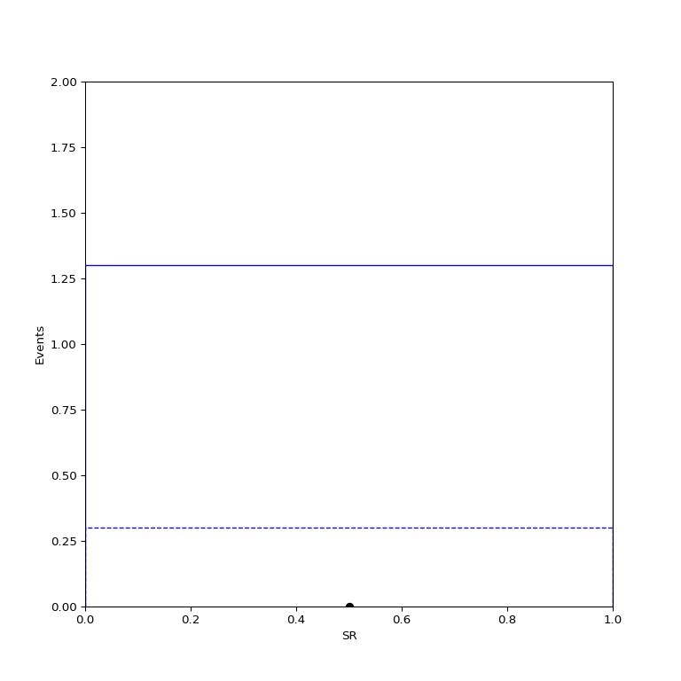
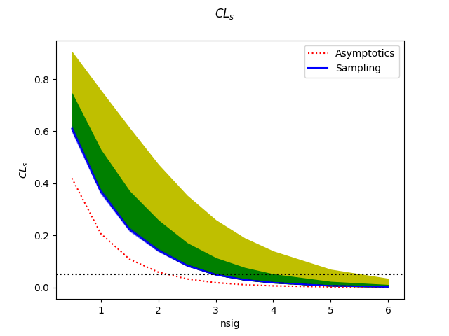

Setting and upper limit on the signal yield in a counting analysis
------------------------------------------------------------------

This tutorial covers the basic usage of the package to define a model, validate its behavior and use it to set toys-based limits on a model parameters.
All the tutorial inputs can be found in `docs/source/tutorials/counting_limit/inputs` in the package installation directory, and the outputs in `docs/source/tutorials/counting_limit/outputs`.
The outputs will anyway be created in the course of the tutorial, but they are provided either as a cross-check or a means to skip some of the steps of the process.

The tutorial will have 4 main steps :

* Setting up the package

* Defining a statistical model

* Setting a limit on the signal cross-section defined in the model

Setting up
##########

The package can be installed and set up by running

.. code-block:: console

  git clone ssh://git@gitlab.cern.ch:7999/nberger/fastprof.git
  cd fastprof/
  source ./setup.sh

and we will run this tutorial in the `run/` working directory:

.. code-block:: console

   cd run/

and for convenience we'll link the tutorial inputs from here: 

.. code-block:: console

   ln -s ../doc/tutorials/counting_limit/inputs
   
Defining the model
##################

Model definitions are stored in JSON files, in the format described in detail in Section :ref:`json_format`.

We will use two examples in this tutorial to illustrate how to build a simple model. In both cases, the model consists of a single counting experiment. In `fastprof` (and `HistFactory`) terms, this defines one *channel*, in this case made up on just one bin. This channel has two contributions, from two sources which we call `Signal` and `Background`. The only *parameter of interest* (POI) of the model (what we wish to measure) is the signal yield, `nsig`. The nominal background contribution is 0.3 events, and the difference between the two models consists in the treatment of the background uncertainty:

* In the `simple_counting` model, no background uncertainty is assigned -- the background yield is exactly 0.3 events.

* In the `counting_with_syst` model, a 10% relative uncertainty is assigned to the 0.3 event nominal yield. In this case, the background yields becomes an additional parameter of the model, a `nuisance parameter` (NP). It is free but subject to a constraint that enforces the limited uncertainty on its value. That constraint is taken to be a Gaussian, with a width of 0.03 events reflecting the 10% relative uncertainty.

In both cases, we assume that an experiment has been performed, and 0 events have been observed in the bin, and use this to set a 95% CL upper limit on `nsig` using the :math:`CL_s` method. This is an interesting setting since it is known that the exact result should be about 3 events in both cases. Furthermore it is known the asymptotic approximation is invalid in this setting, yelding limits that are typically closer to 2 events.

Both examples are shown below. First the example with no background uncertainty:

.. literalinclude:: inputs/simple_counting.json
   :language: json
   :linenos:
   :caption: simple_counting.json
   

Note that both the model and the observed data are included in the same file, under the `model` and `data` sections of the file respectively.
The only new elements with respect to the description above is the name of the model (`simple_counting`) and the name of the measurement channel (`SR`). The latter is provided both in the model and the data, and the two must match. A range of 0 to 10 is specified for the POI `nsig`. The `norm` fields specify the sample normalizations, which can be either a parameter (e.g. `nsig`, for the signal) or a numerical value (0.3, for the background)

The model with the uncertainty is similar:
   
.. literalinclude:: inputs/counting_with_syst.json
   :language: json
   :linenos:
   :caption: counting_with_syst.json

Compared to the above, the background normalization is now also a parameter, `np_bkg` (the `np` prefix designates it as an NP, but this is just a convenience for this example). It is also declared in the `NPs` section, where it is given a nominal value (0.3) and a constraint (0.03). Constraints are always Gaussian in `fastprof`, and the `constraint` corresponds to the Gaussian width, which should be 10% of the nominal as discussed above. An *auxiliary observable* corresponding is also defined. This sets  the central value of the constraint, and is part of the observed data.
   
Inspecting the model
####################

The contents of the simple model without systematics can be checked graphically by running

.. code-block:: console

   python -i plot.py -m inputs/simple_counting.json -i Background --setval nsig=1 \
                     -y "0,2" -o simple_counting.png

The options are as follows:

* `-m` (`--model-file`) specifies the file containing the model and the data

* `-i` (`--plot-alone`) specifies that a dashed line should be shown without the specified sample

* `--setval` sets parameters to a given value. Here we set the `nsig` to a non-zero value so it is visible on the plot

* `-y` sets the vertical range, to avoid the legend colliding with the plot

* `-o` (`--output-name`) specifies the name of the output graphics file.

The command You should see the following 

The same can be repeated on the model with systematics, and in this case we can also plot the impact of variations ni the background yield by adding the `--variations` option. The argument is a "number of sigmas", in units of the `variation` value of the parameter. We therefore specify variations of 1 and -1, corresponding to :math:`\pm 1\sigma` variations:

.. code-block:: console

  python -i plot.py --model inputs/counting_with_syst.json --plot-alone Background \
                    --setval nsig=1 --variations np_bkg=1,np_bkg=-1 -y "0,2" \
                    -o counting_with_syst.png

This should produce the following plot:
  

which seems to follow expectations

Fitting the model
#################

Given that the model seems to behave as expected, one can try a few simple fits. We can start with

.. code-block:: console

  ./fit_fast.py -m inputs/simple_counting.json

The output is::

  == Best-fit: nll = -0.999995 @ at parameter values =
  POIs : nsig         =   0.0000

which is as expected since the observed data has 0 events and `nsig` cannot go negative (as seen in the previous section). One can perform a more interesting test by fitting a dataset with 1 event instead, defined as 

.. literalinclude:: inputs/simple_counting_n1.json
   :language: json
   :linenos:
   :caption: simple_counting_n1.json

We now fit with

.. code-block:: console

  ./fit_fast.py -m inputs/simple_counting.json -d inputs/simple_counting_n1.json

Where the second argument (`-d` or `--data-file`) specifies a separate dataset which takes precedence over the one contained in the model file
The output is now::

  == Best-fit: nll = -0.0376357 @ at parameter values =
  POIs : nsig         =   0.7000

which is expected given the background level of 0.3.

The same tests can be perfomed on the model with a systematic uncertainty:

.. code-block:: console

  ./fit_fast.py -m inputs/counting_with_syst.json
  
This yields::

  == Best-fit: nll = -1.00049 @ at parameter values =
  POIs : nsig         =   0.0000
  NPs  : np_bkg       =  -0.0300 (unscaled :       0.2991)

where we can see that the `np_bkg` nuisance parameter is now also free. Its best-fit value is negative, which decreases the background yield from
the nominal 0.3 events and therefore improves the agreement with the 0 events in the dataset. The best-fit value should be even more negative to better 
agree with data, but there is another factor: the `np_bkg` parameter is constrained, so that values away from 0 also incur a likelihood penalty.
The best-fit value is therefore a compromise between the 2 effects, which yields the numerical value shown above.

Similarly to the previous case, one can instead fit a dataset with 1 observed event,

.. literalinclude:: inputs/counting_with_syst_n1.json
   :language: json
   :linenos:
   :caption: counting_with_syst_n1.json

We now fit with

.. code-block:: console

  ./fit_fast.py -m inputs/counting_with_syst.json -d inputs/counting_with_syst_n1.json

with the output::

  == Best-fit: nll = -0.0376357 @ at parameter values =
  POIs : nsig         =   0.7000
  NPs  : np_bkg       =   0.0000 (unscaled :       0.3000)

In this case `np_bkg` remains at 0, since perfect agreement with data can already be obtained by ajusting `nsig` and this does not incur
a likelihood penalty, as would be the case for `np_bkg`.

Hypothesis tests
################

One can also run a hypothesis test by passing `--hypo` option. An example is

.. code-block:: console
  ./fit_fast.py -m inputs/simple_counting.json --hypo nsig=2

Which gives the output::

  == Best-fit: nll = -0.999995 @ at parameter values =
  POIs : nsig         =   0.0000
  NPs  : 
  
  == Profile-likelihood ratio tmu = 3.99999 for hypothesis {'nsig': 2.0}
  -- Profiled NP values :
  POIs : nsig         =   2.0000
  NPs  : 
  
  == Computing the q~mu test statistic
  best-fit nsig =  5.36345e-06
  tmu         =  3.99999
  q~mu        =  3.99999
  pv          =  0.0210099
  cls         =  0.0588599

The first block is the fit with free `nsig` that was already shown above. The second block shows the case of fixed `nsig=2` and the resulting value of :math:`t_{\mu} = -2\log L(\text{xs}=0.2)/L(\text{best fit})` : this is about 4, which in the asymptotic approximation corresponds to a p-value (a.k.a. :math:`CL_{s+b}`) of about 2%, and a :math:`CL_s` exclusion at the 94% CL.

The same can also be done using the model with a background systematic:

.. code-block:: console
  ./fit_fast.py -m inputs/counting_with_syst.json --hypo nsig=2

Which gives the output::

  == Best-fit: nll = -1.00049 @ at parameter values =
  POIs : nsig         =   0.0000
  NPs  : np_bkg       =  -0.0300 (unscaled :       0.2991)
  
  == Profile-likelihood ratio tmu = 3.99999 for hypothesis {'nsig': 2.0}
  -- Profiled NP values :
  POIs : nsig         =   2.0000
  NPs  : np_bkg       =  -0.0300 (unscaled :       0.2991)
  
  == Computing the q~mu test statistic
  best-fit nsig =  5.36345e-06
  tmu         =  3.99999
  q~mu        =  3.99999
  pv          =  0.0210148
  cls         =  0.0588406

which shows as expected a (very) slightly lower exclusion, due to the mitigating effect of the nuisance parameter.
  

Setting an upper limit using toys
#################################

The final goal of this tutorial is set an upper limit on `nsig` using toys, using the default dataset with 0 observed events.
As will be seen below, toys are required here since the event yields involved are too low for asymptotic formulas to work reliably.

Computing the limit involves testing a number of model hypotheses, until the one corresponding to the desired exclusion (usually 95%) is found. In the implementation used in `fastprof`, a scanning technique is used: a number of hypotheses are defined, an exclusion level is computed at each hypothesis, and the limit is found by interpolation (assuming that the hypotheses were well chosen and that the limit actually lies in the scanned range).

For completeness, we start with an asymptotic computation using the command

.. code-block:: console

  ./compute_fast_limits.py -m inputs/simple_counting.json \
         -y nsig=0.5:nsig=1:nsig=1.5:nsig=2:nsig=2.5:nsig=3:nsig=3.5:nsig=4:nsig=5:nsig=6 \
         -o simple_counting_asymptotics.json

The command takes as input a list of hypotheses (`-y` or `--hypos` option) and an output file (`-o` option), and produces the following output::

  | nsig            | pv              | cls             | clb             
  | 0.5             | 0.135628        | 0.419604        | 0.323228        
  | 1               | 0.0702381       | 0.207289        | 0.338842        
  | 1.5             | 0.0379614       | 0.108703        | 0.349221        
  | 2               | 0.0210099       | 0.0588599       | 0.356948        
  | 2.5             | 0.0118076       | 0.0325214       | 0.363072        
  | 3               | 0.00670788      | 0.0182218       | 0.368124        
  | 3.5             | 0.00384148      | 0.0103152       | 0.37241         
  | 4               | 0.0022137       | 0.00588558      | 0.376122        
  | 5               | 0.000745519     | 0.00195009      | 0.3823          
  | 6               | 0.000254556     | 0.000657254     | 0.387302        
  Asymptotic 95% CLs limit for raster 'fast' = 2.13606

The output shows the exclusion at each specified hypothesis value, both in terms of the raw p-value (`pv` column), a.k.a. :math:`CL_{s+b}`, and of :math:`CL_s`. By interpolation, the :math:`CL_s` upper limit is found to be 2.14, illustratating the point that asymptotics are not sufficient here (the true result is known to be about 3).

We therefore now repeat this using toys. We have 10 hypotheses to test, and one needs to generate at least `10000` toys at each hypotheses to estimate the exclusion level reliable. For :math:`CL_s` one needs to double this, since the computation of :math:`CL_b` requires another set of toys for each hypothesis value, generated in the zero-signal hypothesis. In total one therefore needs at least `200,000` toys, which represents a very CPU-intensive task.
The linear models implemented in `fastprof` can process toys quite quickly, typically at 100 Hz or more for simple models such as the ones considered here.

The toys-based limit is run using the same command as above except for an additional option (`-n` or `--ntoys`) specifying the number of toys to run at each hypothesis:

.. code-block:: console

  python -i  ./compute_fast_limits.py -m inputs/simple_counting.json \
         -y nsig=0.5:nsig=1:nsig=1.5:nsig=2:nsig=2.5:nsig=3:nsig=3.5:nsig=4:nsig=5:nsig=6 \  
         -n 10000 -o simple_counting_toys -b 2

The `-b 2` option specifies that the 1 and 2σ bands should be shown on the plots produced. After a few minutes of processing, the output should be as follows:::

  | nsig            | sampling_pv     | sampling_cls    | sampling_clb    | pv              | cls             | clb             
  | 0.5             | 0.22595         | 0.610676        | 0.37            | 0.135628        | 0.419604        | 0.323228        
  | 1               | 0.13765         | 0.369481        | 0.37255         | 0.0702381       | 0.207289        | 0.338842        
  | 1.5             | 0.08345         | 0.22286         | 0.37445         | 0.0379614       | 0.108703        | 0.349221        
  | 2               | 0.052           | 0.142661        | 0.3645          | 0.0210099       | 0.0588599       | 0.356948        
  | 2.5             | 0.0312          | 0.0843585       | 0.36985         | 0.0118076       | 0.0325214       | 0.363072        
  | 3               | 0.0181          | 0.0489123       | 0.37005         | 0.00670788      | 0.0182218       | 0.368124        
  | 3.5             | 0.0107          | 0.0291911       | 0.36655         | 0.00384148      | 0.0103152       | 0.37241         
  | 4               | 0.0068          | 0.0181867       | 0.3739          | 0.0022137       | 0.00588558      | 0.376122        
  | 5               | 0.00225         | 0.00607451      | 0.3704          | 0.000745519     | 0.00195009      | 0.3823          
  | 6               | 0.0008          | 0.00216861      | 0.3689          | 0.000254556     | 0.000657254     | 0.387302        
  Asymptotic 95% CLs limit for raster 'fast' = 2.13606
  Asymptotics, fast model, CLsb : UL(95%) = 1.27299  (N = [1.27298907 0.3       ])
  Sampling   , fast model, CLsb : UL(95%) = 2.0403 +/- 0.0446143 (N = [2.04029976 0.3       ])
  Asymptotics, fast model, CLs  : UL(95%) = 2.13606  (N = [2.13605832 0.3       ])
  Sampling   , fast model, CLs  : UL(95%) = 2.97955 +/- 0.068918 (N = [2.97954761 0.3       ])
  Expected limit band, fast model, -2 sigma band : UL(95%) = 2.97955  (N = [2.97954761 0.3       ])
  Expected limit band, fast model, -1 sigma band : UL(95%) = 2.97955  (N = [2.97954761 0.3       ])
  Expected limit band, fast model, +0 sigma band : UL(95%) = 2.97955  (N = [2.97954761 0.3       ])
  Expected limit band, fast model, +1 sigma band : UL(95%) = 4.00509  (N = [4.00509045 0.3       ])
  Expected limit band, fast model, +2 sigma band : UL(95%) = 5.41304  (N = [5.41304132 0.3       ])

This is similar to the previous output, except that the columns labeled `sampling_` now provide the toys results, which can be compared with those of the asymptotics. As before, the computed limits are shown at the bottom (the numbers in parenthese are the corresponding event yields for the signal and background sample).
The toys-based limits are compatible with the expected 3 events (within the statistical uncertainty due to the limited number of toy iterations, which is about 0.07 here (and could be reduced by generating more toys).

The command should also produce the plot below for the :math:`CL_s` limit:

This shows exclusion p-value as a function of `nsig`, which allows to identify the limit as the crossing with the :math:`p=0.05` level. As expected, the asymptotics and toys-based results are not in good agreement, and one can see that it is the toys-based one that agrees with the 3-event value. The 1σ and 2σ bands around the expectation (which matches the observed in this case) are also shown. Since the limits cannot flutcuate below the expected (which corresponds to 0 observed events), only the positive bands are present.

Note that if the command is interrupted and restarted, the sampling distributions which have already been generated will be simply loaded, and the generation will continue where it left off (however lock files that are left by interrupted jobs should either be removed by hand, or ignored by passing the `--break-locks` option). This also means that once a job has completed, processing another set of observed results with the same model does not need to produce the toys again. For instance running the limit for 1 observed event using:

.. code-block:: console

  python -i  ./compute_fast_limits.py -m inputs/simple_counting.json \
         -d inputs/simple_counting_n1.json \
         -y nsig=0.5:nsig=1:nsig=1.5:nsig=2:nsig=2.5:nsig=3:nsig=3.5:nsig=4:nsig=5:nsig=6 \
         -n 10000 -o simple_counting_toys -b 2

should immediately return the toys-based limit (4 events).
