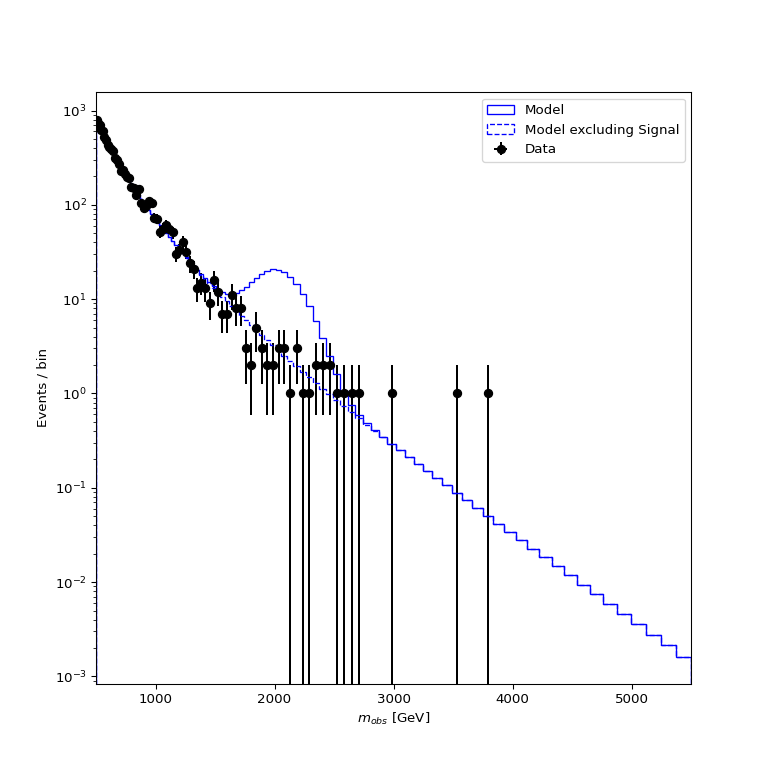
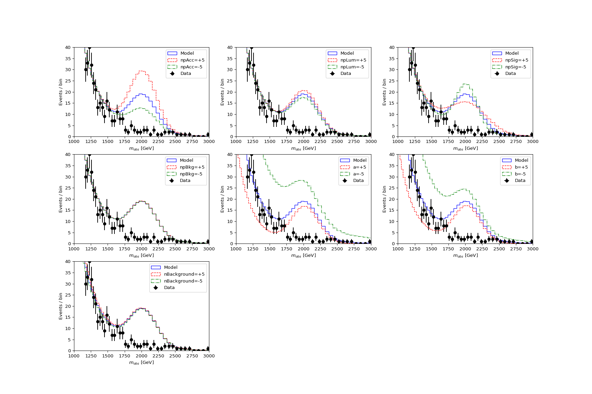
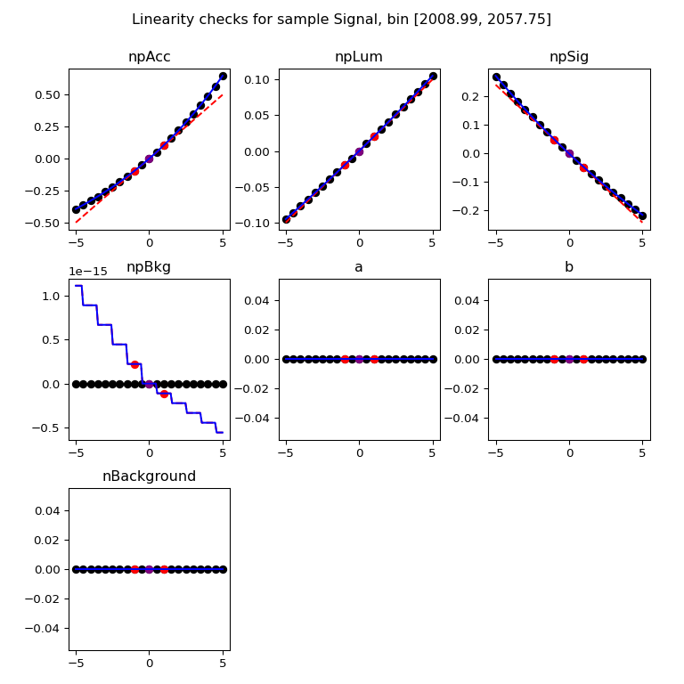
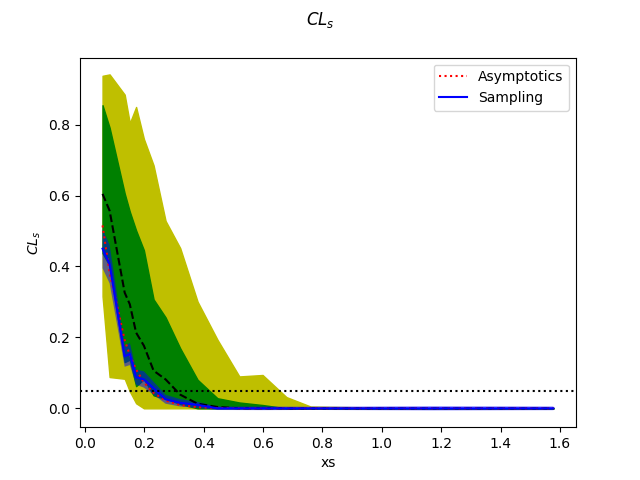
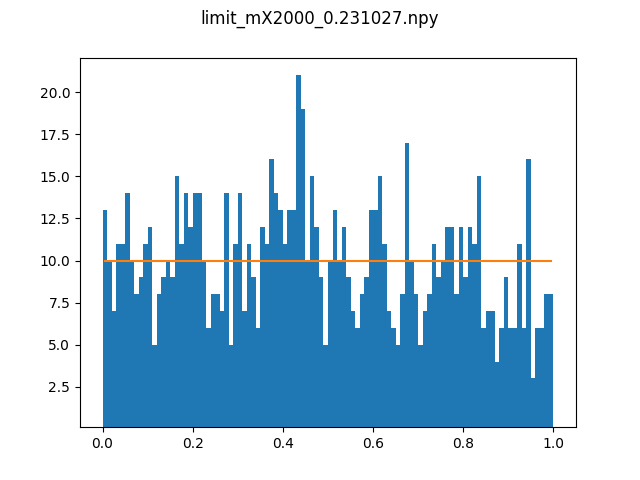
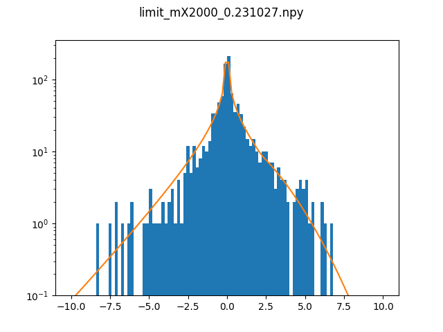
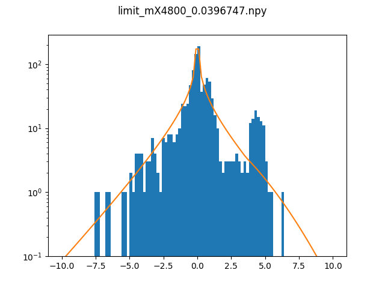
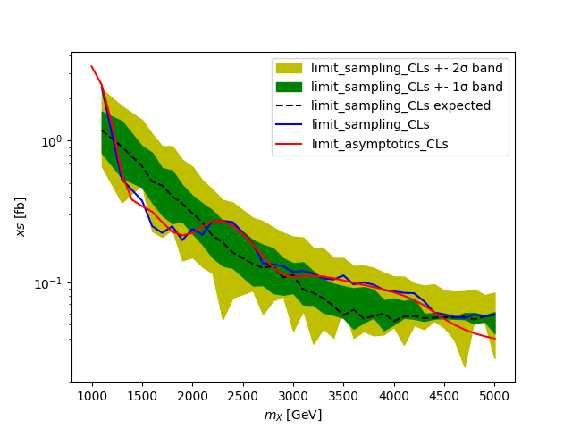

Setting an upper limit on the signal yield in a shape analysis
---------------------------------------------------------------

This tutorial covers the basic usage of the package to define a model, validate its behavior and use it to set toys-based limits on a model parameters.
All the tutorial inputs can be found in `docs/source/tutorials/shape_analysis_limit/inputs` in the package installation directory, and the outputs in `docs/source/tutorials/shape_analysis_limit/outputs`.
The outputs will anyway be created in the course of the tutorial, but they are provided either as a cross-check or a means to skip some of the steps of the process.

The tutorial will have 4 main steps :

* Setting up the package

* Defining a statistical model

* Checking the behavior of the model

* Setting a limit on the signal cross-section defined in the model

Setting up
##########

The package can be installed and set up by running

.. code-block:: console

  git clone ssh://git@gitlab.cern.ch:7999/nberger/fastprof.git
  cd fastprof/
  source ./setup.sh

and we will run this tutorial in the `run/` working directory:

.. code-block:: console

   cd run/

and for convenience we'll link the tutorial inputs from here: 

.. code-block:: console

   ln -s ../doc/tutorials/shape_analysis_limit/inputs
   
Defining the model
##################

Model definitions are stored in JSON files, in the format described in detail in Section :ref:`json_format`. They can be written from scratch, but this example 
will illustrate the use of a utility to convert the content a ROOT workspace.

The input workspace that will be used can be found at `inputs/model.root` (as mentioned above this is `doc/tutorials/shape_analysis_limit/inputs` relative to the installation
directory, but you should have linked `shape_analysis_limit` into your working directory as described in the previous section). It describes a simple shape analysis:

* The analysis observable is :math:`m_{obs}`, studied over the range :math:`500 < m_{obs} < 5500` GeV.

* There are two analysis samples, `Signal` and `Background`. The signal has a yield defined as :math:`N_{\text{Signal}} = \sigma \mathcal{L} (A\times\epsilon)`, where the three terms are respectively the signal cross-section, the integrated luminosity and the efficienty times acceptance value. The signal cross-section is the parameter of interest, and will be denoted by `xs`. The signal shape is a Gaussian, with a peak position equal to the resonance mass :math:`m_X` and a width equal to 10% of :math:`m_X`. The mass :math:`m_X` is a priori unknown. The background shape is defined by a simple function with two free shape parameters :math:`a` and :math:`b`. The background normalization :math:`N_{\text{Background}}` is also free.

* Systematic uncertainties are defined on the integrated luminosity (2%) the acceptance (10%) and the signal peak width (5%). A background modeling uncertainty is defined by small additive contribution to the signal yield, with a magnitude randing from about 30% of the statistical uncertainty on the signal yield at low values of :math:`m_X` to a few percent of the statistical uncertainty at high :math:`m_X`. The uncertainties are all represented by nuisance parameters (NPs) contrained by a Gaussian distribution. For all but the background modeling, their impact is parameterized by an exponential form ("log-normal"), which ensures that the variations never lead to quantities going negative. For the background modeling, the impact is taken to be linear.

The workspace also contains an "observed" dataset, actually a pseudo-dataset produced in the `xs=0` hypothesis.

To convert the workspace to a `fastprof` JSON file, run

.. code-block:: console

  ./convert_ws.py -f inputs/model.root -w modelWS -m mconfig -d obsData \
                  -b 500:5500:100:log --refit xs=0 --binned --setval mX=2000 \
                  --default-sample Background  -l model_mX2000_validation.json -o model_mX2000.json >! model_mX2000.log   

The options are as follows:

* `-f` (`--ws-file`) specifies the input file

* `-w` (`--ws-name`) specifies the workspace name within the file

* `-m` (`--mconfig`) specifies the name of the `ModelConfig` object within the workspace

* `-d` (`--data-name`) specifies the name of the dataset within the workspace. Another option (`--asimov`) can also be provided to use an Asimov dataset instead.

* `-b` (`--binning`) specifies the observable binning to use, in the form `:min:max:nbins[:log]`. The final `log` argument specifies log-scale binning, which is more appropriate here since the with of the peak increases with mass. The number of bins chosen should be large enough to match the mass scales in the model, `100` should be large enough here.

* `--refit xs=0 --binned` specifies that before conversion, the model should be fitted to a binned version of data, under the hypothesis `xs=0`. This ensures that the parameter values for which the output model is built are sufficiently close to what will be needed for the computations, and also that the variations that will be considered (determined from the parameter uncertainties) are of the appropriate size.

* `--setval` sets the value of some model parameters, here `mX`.

* `--default-sample` specifies to which model samples to assign the *unassigned* variations in the event yields -- i.e. the variations that occur when all samples are nomalized to 0. This occurs here for the background modeling uncertainty, so we specify that this should end up in the `Background` sample.

* `-l` (`--validation-data`) specifies that we want to output linearity validation data to the specified file (see below for how this data can be used to validate the model)

* `-o` (`--output-name`) specifies the name of the output file.

Note that the `mX` parameter is treated as constant, with the model generated for `mX=2000` GeV. As will be shown later in this tutorial, this should then be repeated for other values of `mX`. This is mandated by the fact that `fastprof` model only implement two kinds of parameters: normalization parameters, and parameters describing linear transformation of event yields -- and `mX` doesn't fit into either category. However in applications for which `mX` is not a free parameter, as is the case here, this is not an issue.

Inspecting the model
####################

The `model_mX2000.json` file created at the previous step contains descriptions of both the statistical model and the `obsData` dataset that was specified to `convert_ws.py`. One can check that the conversion worked as expected by plotting these contents:

.. code-block:: console

  python -i plot.py -m model_mX2000.json -e Signal --setval xs=3 -l -o model_mX2000.png
  
The options are as follows:

* `-m` (`--model-file`) specifies the file containing the model and the data

* `-e` (`--plot-without`) specifies that a dashed line should be shown without the specified sample

* `--setval` sets parameters to a given value

* `-l` (`--log-scale`) indicates the plot should be drawn in log scale

* `-o` (`--output-name`) specifies the name of the output graphics file.

The value of `xs` is clearly not favored by the data, but it has the benefit of showing clearly both components. If all goes well, you should see the following output:

To check the impact of NP variations, one can add the `--variations` option to have them represented on the plot. For instance

.. code-block:: console

  python -i plot.py -m model_mX2000.json -e Signal --setval xs=3 -l --variations 5 -w 18x10 \
         -o model_mX2000_var5.png

Adds a second plot panel with :math:`\pm 5\sigma` variations corresponding to each NP variations. To get a better look at the effect on the signal, one can zoom into the peak region:

.. code-block:: console

  python -i plot.py -m model_mX2000.json -e Signal --setval xs=3 --variations 5 -w 18x10 \
         --x-range 1000,3000 --y-range 0,40 -o model_mX2000_var5_zoom.png

The last command should produce the plot shown below,
  

from which one can conclude that the variations seem to follow expectations.

Fitting the model
#################

Given that the model seems to behave as expected, one can try a few simple fits. We can start with

.. code-block:: console

  ./fit_model.py -m model_mX2000.json --setrange xs=0:10

where the second argument overrides the range of the POI to :math:`0 \le \text{xs} \le 10` fb. The output is::

  INFO : setting lower bound of xs to 0
  INFO : setting upper bound of xs to 10

  == Best-fit: nll = -216.957 @ at parameter values =
  POIs : xs           =   0.0000
  NPs  : npAcc        =  -0.0000 (unscaled :      -0.0000)
         npLum        =  -0.0000 (unscaled :      -0.0000)
         npSig        =   0.0000 (unscaled :      -0.0000)
         npBkg        =  -0.0004 (unscaled :      -0.0142)
         a            =   0.0451 (unscaled :      10.8000)
         b            =  -0.0589 (unscaled :       0.1081)
         nBackground  =   0.0004 (unscaled :    9886.9951)

  == POI values :
  xs                   = 5.36345e-06 +/-    0.12364

  == Correlation matrix [xs]:
  [[1.]]
  
which can be explained as follows: first, the data clealy favor a near-zero value for the signal, which explains the `xs=0` (see plot above, in fact the best-fut `xs` is slightly negative). Second, you may recall from the beginning of this tutorial that the nominal model parameters are obtained from a fit of the workspace PDF to the data with `xs=0`. In the `fastprof` model, nuisance parameter (NP) values are stored as *pulls* from these nominal values, i.e. as :math:`\theta_{\text{scaled}} = (\theta - \theta_{\text{nominal}})/\sigma_{\theta}`. Therefore the fit to the data performed here should yield `0` for all the NPs by construction. It doesn't turn out to be exactly true due to small differences between the workspace model and the `fastprof` model, but it's close enough. Note that the *unscaled* values corresponding to the parameters as they were in the original model are listed in the printout for comparison.
 
Another test is to run the fit on an Asimov dataset generated for `xs=1` using

.. code-block:: console

  ./fit_model.py -m model_mX2000.json --asimov xs=1 --setrange xs=0:10
  
This yields::

  INFO : setting lower bound of xs to 0
  INFO : setting upper bound of xs to 10
  Using Asimov dataset with parameters {'xs': 1.0}
  
  == Best-fit: nll = -119.813 @ at parameter values =
  POIs : xs           =   1.0000
  NPs  : npAcc        =   0.0000 (unscaled :       0.0000)
         npLum        =   0.0000 (unscaled :       0.0000)
         npSig        =  -0.0000 (unscaled :      -0.0000)
         npBkg        =   0.0000 (unscaled :      -0.0139)
         a            =  -0.0000 (unscaled :      10.7592)
         b            =   0.0000 (unscaled :       0.1102)
         nBackground  =   0.0000 (unscaled :    9886.9596)
  
  == POI values :
  xs                   =   0.999997 +/-    0.18471
  
  == Correlation matrix [xs]:
  [[1.]]

which in this case is exactly as expected: since the Asimov dataset is generated from the `fastprof` model, this is just a sanity check.

Hypothesis tests
################

One can also run a hypothesis test by passing `--hypo` option. An example in data is

.. code-block:: console

  ./fit_model.py -m model_mX2000.json --hypo xs=0.2 --setrange xs=0:10 

Which gives the output::

  INFO : setting lower bound of xs to 0
  INFO : setting upper bound of xs to 10
  
  == Best-fit: nll = -216.957 @ at parameter values =
  POIs : xs           =   0.0000
  NPs  : npAcc        =  -0.0000 (unscaled :      -0.0000)
         npLum        =  -0.0000 (unscaled :      -0.0000)
         npSig        =   0.0000 (unscaled :      -0.0000)
         npBkg        =  -0.0004 (unscaled :      -0.0142)
         a            =   0.0451 (unscaled :      10.8000)
         b            =  -0.0589 (unscaled :       0.1081)
         nBackground  =   0.0004 (unscaled :    9886.9951)
  
  == POI values :
  xs                   = 5.36345e-06 +/-    0.12364
  
  == Correlation matrix [xs]:
  [[1.]]
  
  == Profile-likelihood ratio tmu = 4.24341 for hypothesis {'xs': 0.2}
  -- Profiled NP values :
  POIs : xs           =   0.2000
  NPs  : npAcc        =  -0.2865 (unscaled :      -0.2865)
         npLum        =  -0.0572 (unscaled :      -0.0572)
         npSig        =   0.1314 (unscaled :       0.1314)
         npBkg        =  -0.0157 (unscaled :      -0.0295)
         a            =   0.7124 (unscaled :      11.4030)
         b            =  -0.6407 (unscaled :       0.0870)
         nBackground  =  -0.0871 (unscaled :    9878.3038)
  
  == Computing the q~mu test statistic
  best-fit xs =  5.36345e-06
  tmu         =  4.24341
  q~mu        =  4.24341
  pv          =  0.0118385
  cls         =  0.0677161

The first block is the fit with free `xs` that was already shown above. The second block shows the fit with fixed `xs=0.2` fb, which as expected shows some pulls in the NP -- in particular downward pulls in `npAcc`, which is associated with a 10% uncertainty and therefore is able to mitigate a bit the discrepancy between the `xs=0.2` hypothesis and the `xs=0` value preferred by data. The resulting value of :math:`t_{\mu} = -2\log L(\text{xs}=0.2)/L(\text{best fit})` is about 4, which in the asymptotic approximation corresponds to a p-value (a.k.a. :math:`CL_{s+b}`) of about 1%, and a :math:`CL_s` exclusion at the 93% CL.

Validating the model
####################

Before going further, some further validation must be performed: so far we have shown that the model behaves reasonably, but we also need to check that it provides a sufficiently close approximation to the original workspace model. Differences can appear for at least two reasons: first, from the approximation that the impact of NPs on the bin yields is linear; and second from the binning itself, since the original model awas unbinned.

The linearity can be checked using data in the file `model_mX2000_validation.json` which should have been produced together with `model_mX2000.json` at the beginning of this tutorial. It contains information on bin yield variations in the original model, which can be compared with those of the `fastprof` model. The comparison can be performed using a dedicated script:

.. code-block:: console

  python -i plot_valid.py -m model_mX2000.json -s Signal -b 58

This performs the comparison for the specified model (the variations are taken by default from the file with the same name, except for `_validation` appended before the extension), and considers impacts on sample `Signal` in bin 58, corresponding to the peak of the signal. The result is as follows:
  

and the following for the `Background` sample:

.. image:: outputs/model_mX2000-Background-bin_58.png
    :width:  70%
    :align:  center

The variations in the original model are shown as dots, while those in the `fastprof` model are shown as lines. In each case the purple dot corresponds to the nominal yield (no variation), while the samples in red are the ones used to build the variations in the `fastprof` model. The two lines correspond to the fully linear impacts used for minimization, shown in the dotted red line, and the exponential form used to evaluate the likelihood (which avoids producing negative yields), shown in the solid blue line. In the ideal case, both lines should pass very close to all the points.

As seen on the plots, this is not fully the case: for the signal, the rather large acceptance systematic (10%), which has an exponential impact, leads to small deviations from linearity which are well reproduced by the exponential form (blue line) but only approximately by the linear form (dotted red line). In the background, the `a` and `b` shape parameters have non-linear impacts that are again well approximated by the exponential form but less so by the linear form. The unusual shape of the `npBkg` plot in the signal is due to numerical effects since this parameter has essentially no impact here (note the vertical scale).

One can find larger deviations from linearity for the uncertainty on the signal peak width `npSig` in bins further away from the peak (e.g. bin 65), but these have limited impact on the result since the nominal bin yields are quite low.

A more general check is to compare the fit results in the original model and the `fastprof` model. The current implementation of the test is targeted towards limit-setting, and consists in performing fits of the model to the data, for various values of `xs` close to the 95% CL limit value. These fits are performed in the original model, and the results are then compared to those of the linear model. The command to perform the fits to the original model is:

.. code-block:: console

  ./fit_ws.py -f inputs/model.root -d obsData --binned --setval mX=2000 \
              -o wsfits_mX2000.json  >! wsfits_mX2000.log
  
By default this considers 17 hypotheses (the expected 95% CL limit, plus 8 hypotheses above and 8 more below), and the fit results are stored in the output file `wsfits_mX2000.json`, which is again a JSON file with fairly explicit content. The comparison with fast results is performed by running the command:

.. code-block:: console

  ./check_model.py -m model_mX2000.json -f wsfits_mX2000.json

which produces the following output::

  Using dataset stored in file model_mX2000.json.
  | xs              | pv              | pv (fast)       | cls             | cls (fast)      | clb             | clb (fast)      
  | 0.0590594       | 0.085648        | 0.0857845       | 0.515737        | 0.506457        | 0.166069        | 0.169382        
  | 0.0828268       | 0.0643007       | 0.0635816       | 0.383213        | 0.374089        | 0.167794        | 0.169964        
  | 0.133704        | 0.0328582       | 0.0319086       | 0.192338        | 0.185648        | 0.170835        | 0.171876        
  | 0.150902        | 0.0257858       | 0.0249156       | 0.150101        | 0.144323        | 0.17179         | 0.172638        
  | 0.172087        | 0.0189446       | 0.0182001       | 0.109537        | 0.104821        | 0.172952        | 0.17363         
  | 0.198362        | 0.0127411       | 0.012161        | 0.0730821       | 0.069522        | 0.17434         | 0.174923        
  | 0.231027        | 0.00762897      | 0.0072229       | 0.0433198       | 0.0408989       | 0.176108        | 0.176604        
  | 0.271434        | 0.00392851      | 0.00368757      | 0.0220528       | 0.0206289       | 0.178141        | 0.178757        
  | 0.320684        | 0.00168524      | 0.00156542      | 0.00932914      | 0.00862777      | 0.180642        | 0.18144         
  | 0.379177        | 0.000588936     | 0.000540001     | 0.00320647      | 0.0029246       | 0.183671        | 0.184641        
  | 0.446215        | 0.000167406     | 0.000151171     | 0.000895275     | 0.000803038     | 0.186988        | 0.188249        
  | 0.519999        | 3.98138e-05     | 3.52294e-05     | 0.00020884      | 0.000183422     | 0.190642        | 0.192067        
  | 0.598183        | 8.28221e-06     | 7.14205e-06     | 4.26003e-05     | 3.64634e-05     | 0.194417        | 0.195869        
  | 0.678664        | 1.58081e-06     | 1.31791e-06     | 7.98037e-06     | 6.60703e-06     | 0.198088        | 0.199471        
  | 0.760086        | 2.86927e-07     | 2.28756e-07     | 1.42293e-06     | 1.12821e-06     | 0.201646        | 0.202761        
  | 1.16902         | 4.32348e-11     | 2.09119e-11     | 1.99238e-10     | 9.79127e-11     | 0.217001        | 0.213577        
  | 1.57807         | 6.3377e-15      | 8.38218e-16     | 2.76586e-14     | 3.89133e-15     | 0.22914         | 0.215406        
  Asymptotic 95% CLs limit for raster 'data' = 0.2222
  Asymptotic 95% CLs limit for raster 'fast' = 0.21881

This shows the main quantities of interest for setting a limit on `xs` : each line corresponds to the `xs` hypothesis given in the first column, and the following columns give computed p-values. The columns go in pairs, where one column gives the results for the original model, and the next one (labeled 'fast') gives the result of the linear model. The quantities listed are raw p-value (a.k.a. :math:`CL_{s+b}`, modified frequentist p-value (:math:`CL_s`), and the :math:`CL_b` value that links the two. One can pass the `-v 2` or `-v 3` options to get more output. 

The conclusion here is that the computed p-values are quite well reproduced by the linear model, up to differences at the level of a few percent. One can estimate the :math:`CL_s` limit by interpolating the `xs` values where the `cls` value reaches 5%, and this is provided in the last 2 lines for both models. Again the difference is small, at about 2%. Overall, one can conclude that at this mass value, the linear model seems to provide a sufficiently accurate reproduction of the full model for most applications. This should of course be checked also for a few other mass points over the spectrum, to ensure this remains valid in other regime (very high / very low event yields, etc.)

Setting an upper limit using toys
#################################

Now that the model is validated, we can use it to go a bit beyond what was possible with the original model. The application here is limit-setting using toys: this is required in settings where the expected event yields are too low for asymptotic formulas to work reliable, but it is also quite CPU-intensive and generally difficult to perform in realistic situations.

To give an estimate of the size of the problem, computing a limit typically involves testing a number of model hypotheses, until the one corresponding to the desired exclusion (usually 95%) is found. In this package, a scanning technique is used: first the approximate value of the limit is evaluated, and a number of hypotheses above and below this value are determined. The exclusion level is then computed at each hypotheses, and the limit is found by interpolation (assuming that the hypotheses were well chosen and that the limit actually lies in the scanned range).

By default the package considers 17 hypotheses (the estimated limit, plus 8 hypothesis values above it and 8 below). This is a bit larger than strictly needed, but allows to estimate the expected variation bands of the limits at the same time, and defines a fine grid near the expected limit for precise interpolation. One needs to generate at least `10000` toys at each hypotheses to estimate the exclusion level reliable. For :math:`CL_s` one needs to double this, since the computation of :math:`CL_b` requires another set of toys for each hypothesis value, generated in the zero-signal hypothesis. In total one therefore needs at least `340000` toys, which represents a very CPU-intensive task: for models requiring several seconds to process one toy iteration, the total running time would be of the order of a few days.

Linear models can run much faster, typically processing toys at 10--100 Hz. The simple model considered here should be near the upper end of this spectrum, but to keep the running time of this exercise at a minimum, we nevertheless reduce the number of toys to only 1000 per hypotheses, which should run in a couple of minutes or so.

With the setup above, the procedure reduces to running the following command:

.. code-block:: console

  ./compute_limits.py -m model_mX2000.json -f wsfits_mX2000.json -n 1000 --print-freq 100 \
                      -o limit_mX2000 >! limit_mX2000.log

The file specified with `-f` is the one that was produced in the previous section, containing fit results from the original model at each hypothesis point. It plays two roles: first, it defines the tested hypotheses -- as described above, this is based on an estimate of the upper limit value in the original model. Second, it provides the values of the test statistics for these hypotheses, computed from the original model. This means that while the sampling distributions will be built from the fast model, the p-value computed using these distributions will be based on the "exact" test statistic values from the original model.

The `-n` options specifies the number of toys, and `--print-freq` the frequency of the printouts. The command produces first the :math:`CL_{s+b}` toys for each of the 17 hypotheses, and then the corresponding set of :math:`CL_b` toys. The sampling distributions are stored in more JSON files with the specified `limit_mX2000` prefix. Lock files are used to ensure multiple jobs are able to run in parallel to speed up generation.  If the command is interrupted and restarted, the sampling distributions which have already been generated will be simply loaded, and the generation will continue where it left off (however lock files that are left by interrupted jobs should either be removed by hand, or ignored by passing the `--break-locks` option).

We can make use of this feature by running again

.. code-block:: console

  python -i compute_limits.py -m model_mX2000.json -f wsfits_mX2000.json -n 1000 --bands 2 \
                              -o limit_mX2000
  
This will simply load the distributions produced at the previous step, and show the results. The first part of the output is identical to what was produced by `check_model.py` above, and allows to check that the linear model reproduces the asymptotic results sufficiently well. This is a prerequisite for the next step of computing toys-based limits. After informing the user that existing sampling distributions have been found and loaded, the output should be as follows::

  | xs              | sampling_pv     | sampling_cls    | sampling_clb    | pv              | cls             | clb             
  | 0.0590594       | 0.086           | 0.502924        | 0.171           | 0.085648        | 0.515737        | 0.166069        
  | 0.0828268       | 0.072           | 0.404494        | 0.178           | 0.0643007       | 0.383213        | 0.167794        
  | 0.133704        | 0.043           | 0.245714        | 0.175           | 0.0328582       | 0.192338        | 0.170835        
  | 0.150902        | 0.023           | 0.121693        | 0.189           | 0.0257858       | 0.150101        | 0.17179         
  | 0.172087        | 0.015           | 0.0746269       | 0.201           | 0.0189446       | 0.109537        | 0.172952        
  | 0.198362        | 0.01            | 0.0537634       | 0.186           | 0.0127411       | 0.0730821       | 0.17434         
  | 0.231027        | 0.006           | 0.0301508       | 0.199           | 0.00762897      | 0.0433198       | 0.176108        
  | 0.271434        | 0.004           | 0.021164        | 0.189           | 0.00392851      | 0.0220528       | 0.178141        
  | 0.320684        | 0.001           | 0.00502513      | 0.199           | 0.00168524      | 0.00932914      | 0.180642        
  | 0.379177        | 0.001           | 0.00487805      | 0.205           | 0.000588936     | 0.00320647      | 0.183671        
  | 0.446215        | 0               | 0               | 0.202           | 0.000167406     | 0.000895275     | 0.186988        
  | 0.519999        | 0               | 0               | 0.207           | 3.98138e-05     | 0.00020884      | 0.190642        
  | 0.598183        | 0               | 0               | 0.194           | 8.28221e-06     | 4.26003e-05     | 0.194417        
  | 0.678664        | 0               | 0               | 0.2             | 1.58081e-06     | 7.98037e-06     | 0.198088        
  | 0.760086        | 0               | 0               | 0.202           | 2.86927e-07     | 1.42293e-06     | 0.201646        
  | 1.16902         | 0               | 0               | 0.188           | 4.32348e-11     | 1.99238e-10     | 0.217001        
  | 1.57807         | 0               | 0               | 0.185           | 6.3377e-15      | 2.76586e-14     | 0.22914         
  Asymptotic 95% CLs limit for raster 'data' = 0.2222
  Asymptotics, full model, CLsb : UL(95%) = 0.102551  (N = [5.74283455e+00 9.88695782e+03])
  Asymptotics, fast model, CLsb : UL(95%) = 0.101109  (N = [5.66211886e+00 9.88695782e+03])
  Sampling   , fast model, CLsb : UL(95%) = 0.128519 +/- 0.00546102 (N = [7.19706390e+00 9.88695782e+03])
  Asymptotics, full model, CLs  : UL(95%) = 0.2222  (N = [  12.44320922 9886.95781811])
  Asymptotics, fast model, CLs  : UL(95%) = 0.21881  (N = [  12.25336645 9886.95781811])
  Sampling   , fast model, CLs  : UL(95%) = 0.202712 +/- 0.0218487 (N = [  11.35188337 9886.95781811])

This is similar to the previous output, except that the columns labeled `sampling_` now provide the toys results, which can be compared with those of the asymptotics. As before, the computed limits are shown at the bottom (the numbers in parenthese are the corresponding event yields for the signal and background sample). In this example, where the asymptotics are close to valid, the samplind and asymptotic results are quite close, differing by about 10% in the :math:`CL_s` limits (0.203 fb for the toys, and 0.222 fb for the asymptotics). However one can note that the uncertainty from the limited size of the sampling dsitibution is 0.022 fb, which almost covers the difference. The "Asymptotics, fast" line refers to the result obtained when the observed values of the test statistics are computed from the fast model instead of the original one. It is of course more precise to use the latter (which can be computed from the fit results in the `wsfits` file), but the two results should be reasonably close if the linear model is a good approximation to the original, as seems the case here.

The command will also produce a plot, as below:

since we have specified the `--bands 2` option, this includes :math:`1\sigma` and  :math:`2\sigma` bands around the expected limit, although the number of toys is not quite sufficient to get an accurate computation here. The 95% CL limit occurs when the curves cross the dotted line corresponding to a p-value of 5%. The width of the sampling curve reflects the uncertainty due to the limited size of the sampling distributions.

For an example with larger differences, one can re-run the exercise for a higher mass value, for instance `mX=4500` GeV:

.. code-block:: console

  ./convert_ws.py -f inputs/model.root -w modelWS -m mconfig -d obsData \
                -b 500:5500:100:log --refit xs=0 --binned --setval mX=4800 \
                --default-sample Background -o model_mX4800.json >! model_mX4800.log   
  ./fit_ws.py -f inputs/model.root -d obsData --binned --setval mX=4800 \
                -o wsfits_mX4800.json >! wsfits_mX4800.log
  ./compute_limits.py -m model_mX4800.json -f wsfits_mX4800.json -n 1000  --print-freq 100 \
                -o limit_mX4800 >! limit_mX4800.log

After a few more minutes of processing, running

.. code-block:: console

  python -i compute_limits.py -m model_mX4800.json -f wsfits_mX4800.json -n 1000 -o limit_mX4800

should now yield::

  Asymptotics, full model, CLs  : UL(95%) = 0.0435273  (N = [2.43752697e+00 9.88695653e+03])
  Asymptotics, fast model, CLs  : UL(95%) = 0.0422649  (N = [2.36683552e+00 9.88695653e+03])
  Sampling   , fast model, CLs  : UL(95%) = 0.0592869 +/- 0.00425652 (N = [3.32006645e+00 9.88695653e+03])

Which shows the expected behavior : while the asymptptic limits drop below 3 signal events, the toys-based results remain above as they should.

To check the result in a bit more detail, one can have a look in the log file `limit_mX2000.log`. A point to check in particular is the number of generation retries: this occurs by default if the PLR `tmu` was found to be negative, which should never happen and is a sign that one or both of the fits did not converge. In this case, the toy is discarded and a new one is generated instead. This can potentially lead to biases, and should be monitored to ensure the fraction of retries remains small. This can be checked by parsing the log file, and looking in particular at the total number of toys generated for each sample (including retries), for instance:::

  Generated 1000 good toys (1001 total), elapsed time = 5.73927 s

Finally, one can have a look at one of the sampling distributions that were produced. These are natively stored in terms of asymptotic p-value, which is convenient for comparison with asymptotics: if the asymptotics are valid, the distribution of the p-values should be flat. We can check this by looking at the p-value sampling distribution for one of the signal hypotheses produced for the `mX=2000` GeV mass point, using the command

.. code-block:: console

  python -i dump_samples.py limit_mX2000_0.231027.npy -r -o sampling_pv.png

This produces the following output, which does seem approximately flat within the uncertainties due to the small number of toys produced:
  

The `-r` flag indicates that the reference curve for the asymptotics case should also be drawn -- here just a flat distribution. The distributions can also be expressed in terms of the test statistic, for example :math:`\tilde{q}_{\mu}`, using

.. code-block:: console

  python -i dump_samples.py limit_mX2000_0.231027.npy -m model_mX2000.json \
                 -y wsfits_mX2000.json:6 -t q~mu -l -r -o sampling_tmu.png

This requires a bit more information, needed to compute the test statistic values: namely the `wsfits` file, with also the index of the hypothesis we are looking at (here, `6`). The result is as follows:
  

Again, the asymptotics seem well reproduced, as expected. Less Gaussian examples can be seen for the `mX=4800` mass point, for instance

.. code-block:: console

  python -i dump_samples.py limit_mX4800_0.0396747.npy -m model_mX4800.json \
             -y wsfits_mX4800.json:4 -t q~mu -l -r -o sampling_tmu_4800.png

shows the following distribution:

Setting toy limits as a function of mass
########################################

As a final exercise, we can repeat the steps above for a range of masses. Given the width of the signal peak, we will compute the limit in steps of 100 GeV, and cover the range from 1000 to 5000 GeV. This requires iterating the commands above over several mass points, which can be simplified by using the `iterate.py` script. For instance, running

.. code-block:: console

  ./iterate.py -p 1000:5000:41:int -c "\
    ./convert_ws.py -f inputs/model.root -w modelWS -m mconfig -d obsData \
        -b 500:5500:100:log --refit xs=0 --binned --setval mX=% \
        --default-sample Background -o model_mX%.json >! model_mX%.log \n \
    ./fit_ws.py -f inputs/model.root -d obsData --binned --setval mX=% \
        -o wsfits_mX%.json >! wsfits_mX%.log \n \
    ./compute_limits.py -m model_mX%.json -f wsfits_mX%.json -n 1000 --print-freq 100 \
        --bands 2 -o limit_mX% >! limit_mX%.log \
  " >! commands
  
  source commands

will produce a list of model-building commands similar to the ones used above. In each one, the '%' sign in the argument to the `-c` option gets replaced in turn by the appropriate mass values. The `-p 1000:5000:41:int` option specifies 41 points between 1000 and 5000, rounded to the nearest integer, which corresponds to the 100 GeV step we wanted. The `source` command will run all the limits sequentially, but one can also run them in parallel on different CPUs (or even use multiple CPUs for a single limit, exploiting the lock file mechanism decribed above).

Note also the `--bands 2` argument, which computes the :math:`1\sigma` and  :math:`2\sigma` bands around the expected limit. This isn't really reliable with only 1000 toys per sampling distribution, as we'll see below, but is included for illustration purposes.

After a few hours of running, all the limits should have been processed and one should have a `limit_mXxxxx_results.json` file in the working directory for each of the mass points. At this point one can combine all the results into a single plot by running

.. code-block:: console

  python -i collect_results.py -p 1000:5000:41:int -i limit_mX%_results.json -v m_X -u GeV \
      -k limit_sampling_CLs,limit_asymptotics_CLs -b 2 -l  -o limit_all.json

The syntax is similar to the one for `iterate.py` above, with `-p` specifying the mass points and `-i` the input files with the `%` wildcard. The `-k` option give the key values for the results we want. These can be inspected by looking at the contents of one of the JSON results file, and here we specify the :math:`CL_s` limit obtained from the sampling method, which is stored under `limit_sampling_CLs`, and the one computed with asymptotics, `limit_asymptotics_CLs`. The `-v` and `-u` options specify the name and unit of the scanned variable, for plotting purposes .The `--bands 2` option is passed to plot the :math:`1\sigma` and  :math:`2\sigma` bands around the expected limit. As already mentioned, one would need many more toys to get a reliable result, but this is included for illustration.

The collected results are written to `limit_all.json`, and a plot is drawn. Output in `ROOT` format can also be provided by passing the `--root-output` option. 

The produced plot is shown below:

Ignoring the noise from the limited sample sizes, one can identify the expected difference between toys and asymptotics at high mass, with the toys-based limit saturating at the 3-event value while the asymptotic results falls below. The negative variations bands can also be seen to collapse at high mass as expected.
