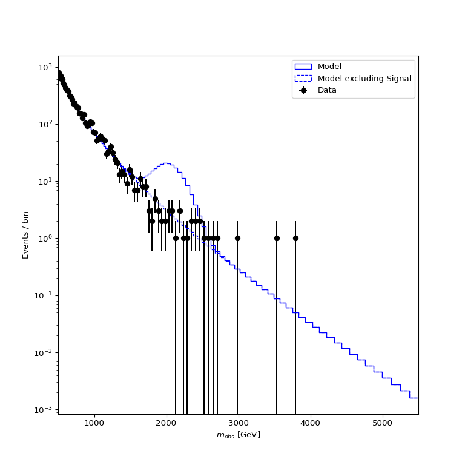
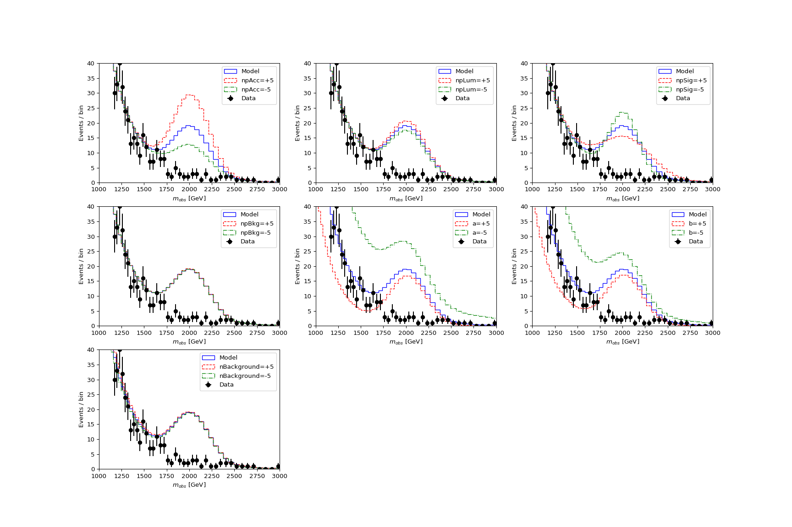
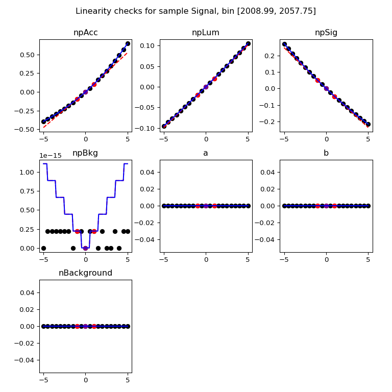
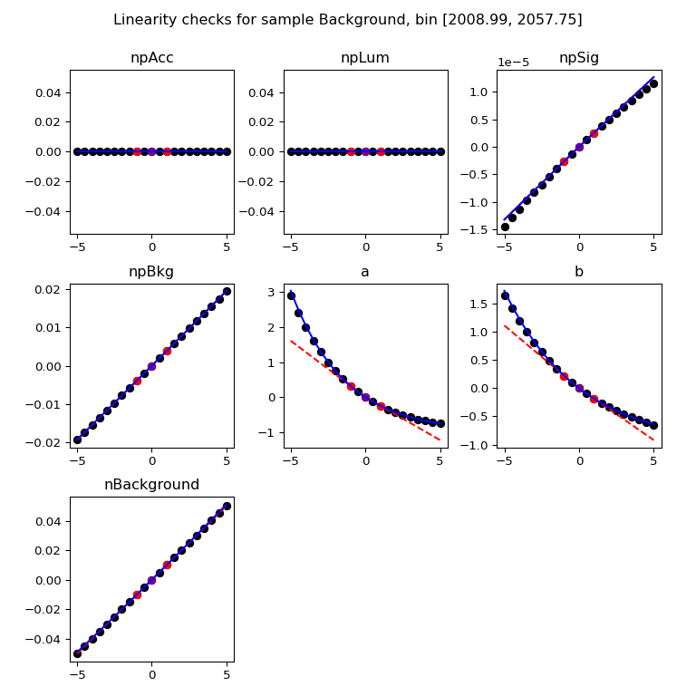

Setting and upper limit on the signal yield in a shape analysis
---------------------------------------------------------------

This tutorial covers the basic usage of the package to define a model, validate its behavior and use it to set toys-based limits on a model parameters.
All the tutorial inputs can be found in `docs/source/tutorials/limit_setting/inputs` in the package installation directory, and the outputs in `docs/source/tutorials/limit_setting/outputs`.
The outputs will anyway be created in the course of the tutorial, but they are provided either as a cross-check or a means to skip some of the steps of the process.

The tutorial will have 4 main steps :

* Setting up the package

* Defining a statistical model

* Checking the behavior of the model

* Setting a limit on the signal cross-section defined in the model

Setting up
##########

Defining the model
##################

Model definitions are stored in JSON files, in the format described in detail in Section :ref:`json_format`. They can be written from scratch, but this example 
will illustrate the use of a utility to convert the content a ROOT workspace.

The input workspace that will be used can be found at `limit_setting/inputs/model.root` (as mentioned above this is `docs/source/tutorials/limit_setting/inputs` relative to the installation
directory, but you should have linked `limit_setting` into your working directory as described in the previous section). It describes a simple shape analysis:

* The analysis observable is :math:`m_{obs}`, studied over the range :math:`500 < m_{obs} < 5500` GeV.

* There are two analysis samples, `Signal` and `Background`. The signal has a yield defined as :math:`N_{\text{Signal}} = \sigma \mathcal{L} (A\times\epsilon)`, where the three terms are respectively the signal cross-section, the integrated luminosity and the efficienty times acceptance value. The signal cross-section is the parameter of interest, and will be denoted by `xs`. The signal shape is a Gaussian, with a peak position equal to the resonance mass :math:`m_X` and a width equal to 10% of :math:`m_X`. The mass :math:`m_X` is a priori unknown. The background shape is defined by a simple function with two free shape parameters :math:`a` and :math:`b`. The background normalization :math:`N_{\text{Background}}` is also free.

* Systematic uncertainties are defined on the integrated luminosity (2%) the acceptance (10%) and the signal peak width (5%). A background modeling uncertainty is defined by small additive contribution to the signal yield, with a magnitude randing from about 30% of the statistical uncertainty on the signal yield at low values of :math:`m_X` to a few percent of the statistical uncertainty at high :math:`m_X`. The uncertainties are all represented by nuisance parameters (NPs) contrained by a Gaussian distribution. For all but the background modeling, their impact is parameterized by an exponential form ("log-normal"), which ensures that the variations never lead to quantities going negative. For the background modeling, the impact is taken to be linear.

The workspace also contains an "observed" dataset, actually a pseudo-dataset produced in the `xs=0` hypothesis.

To convert the workspace to a `fastprof` JSON file, run

.. code-block:: console

  convert_ws.py -f limit_setting/inputs/model.root -w modelWS -m mconfig -d obsData \
                -b 500:5500:100:log --refit xs=0 --binned --setval mX=2000 \
                --default-sample Background -o model_mX2000.json >! model.log   

The options are as follows:

* `-f` (`--ws-file`) specifies the input file

* `-w` (`--ws-name`) specifies the workspace name within the file

* `-m` (`--mconfig`) specifies the name of the `ModelConfig` object within the workspace

* `-d` (`--data-name`) specifies the name of the dataset within the workspace. Another option (`--asimov`) can also be provided to use an Asimov dataset instead.

* `-b` (`--binning`) specifies the observable binning to use, in the form `:min:max:nbins[:log]`. The final `log` argument specifies log-scale binning, which is more appropriate here since the with of the peak increases with mass. The number of bins chosen should be large enough to match the mass scales in the model, `100` should be large enough here.

* `--refit xs=0 --binned` specifies that before conversion, the model should be fitted to a binned version of data, under the hypothesis `xs=0`. This ensures that the parameter values for which the output model is built are sufficiently close to what will be needed for the computations, and also that the variations that will be considered (determined from the parameter uncertainties) are of the appropriate size.

* `--setval` sets the value of some model parameters, here `mX`.

* `--default-sample` specifies to which model samples to assign the *unassigned* variations in the event yields -- i.e. the variations that occur when all samples are nomalized to 0. This occurs here for the background modeling uncertainty, so we specify that this should end up in the `Background` sample.

* `-o` (`--output-name`) specifies the name of the output file.

Note that the `mX` parameter is treated as constant, with the model generated for `mX=2000` GeV. As will be shown later in this tutorial, this should then be repeated for other values of `mX`. This is mandated by the fact that `fastprof` model only implement two kinds of parameters: normalization parameters, and parameters describing linear transformation of event yields -- and `mX` doesn't fit into either category. However in applications for which `mX` is not a free parameter, as is the case here, this is not an issue.

Inspecting the model
####################

The `model_mX2000.json` file created at the previous step contains descriptions of both the statistical model and the `obsData` dataset that was specified to `convert_ws.py`. One can check that the conversion worked as expected by plotting these contents:

.. code-block:: console

  python -i plot.py -m model_mX2000.json -e Signal --setval xs=3 -l -o model_mX2000.png
  
The options are as follows:

* `-m` (`--model-file`) specifies the file containing the model and the data

* `-e` (`--plot-without`) specifies that a dashed line should be shown without the specified sample

* `--setval` sets parameters to a given value

* `-l` (`--log-scale`) indicates the plot should be drawn in log scale

* `-o` (`--output-name`) specifies the name of the output graphics file.

The value of `xs` is clearly not favored by the data, but it has the benefit of showing clearly both components. If all goes well, you should see the following output:

To check the impact of NP variations, one can add the `--variations` option to have them represented on the plot. For instance

.. code-block:: console

  python -i plot.py -m model_mX2000.json -e Signal --setval xs=3 -l --variations 5 -o model_mX2000_var5.png

Adds a second plot with :math:`\pm 5\sigma` variations corresponding to each NP variations. To get a better look at the effect on the signal, one can zoom into the peak region:

.. code-block:: console

  python -i plot.py -m model_mX2000.json -e Signal --setval xs=3 --variations 5 --x-range 1000,3000 --y-range 0,40 -o model_mX2000_var5_zoom.png

The last command should produce the plot shown below,
  

from which one can conclude that the variations seem to follow expectations.

Fitting the model
#################

Given that the model seems to behave as expected, one can try a few simple fits. We can start with

.. code-block:: console

  fit_fast.py -m model_mX2000.json --setrange xs:0:10

where the second argument overrides the range of the POI to :math:`0 \le xs le 10` fb. The output is::

  INFO : setting lower bound of xs to 0
  INFO : setting upper bound of xs to 10
  
  == Best-fit: nll = -268.608 @ at parameter values =
  POIs : xs           =   0.0000
  NPs  : npAcc        =  -0.0000 (unscaled :      -0.0000)
         npLum        =  -0.0000 (unscaled :      -0.0000)
         npSig        =   0.0000 (unscaled :      -0.0000)
         npBkg        =  -0.0004 (unscaled :      -0.0142)
         a            =   0.0452 (unscaled :      10.8009)
         b            =  -0.0597 (unscaled :       0.1080)
         nBackground  =  -0.0001 (unscaled :    9886.9930)
  
 which can be explained as follows: first, the data clealy favor a near-zero value for the signal, which explains the `xs=0` (see plot above, in fact the best-fut `xs` is slightly negative). Second, you may recall from the beginning of this tutorial that the nominal model parameters are obtained from a fit of the workspace PDF to the data with `xs=0`. In the `fastprof` model, nuisance parameter (NP) values are stored as *pulls* from these nominal values, i.e. as :math:`\theta_{\text{scaled}} = (\theta - \theta_{\text{nominal}})/\sigma_{\theta}`. Therefore the fit to the data performed here should yield `0` for all the NPs by construction. It doesn't turn out to be exactly true due to small differences between the workspace model and the `fastprof` model, but it's close enough. Note that the *unscaled* values corresponding to the parameters as they were in the original model are listed in the printout for comparison.
 
 Anther test is to run the fit on an Asimov dataset generated for `xs=1` using

  .. code-block:: console

  fit_fast.py -m model_mX2000.json --asimov xs=1 --setrange xs:0:10
  
This yields::

  INFO : setting lower bound of xs to 0
  INFO : setting upper bound of xs to 10
  Using Asimov dataset with parameters {'xs': 1.0}
  
  == Best-fit: nll = -162.15 @ at parameter values =
  POIs : xs           =   1.0000
  NPs  : npAcc        =   0.0000 (unscaled :       0.0000)
         npLum        =   0.0000 (unscaled :       0.0000)
         npSig        =  -0.0000 (unscaled :      -0.0000)
         npBkg        =   0.0000 (unscaled :      -0.0138)
         a            =  -0.0000 (unscaled :      10.7601)
         b            =   0.0000 (unscaled :       0.1102)
         nBackground  =   0.0000 (unscaled :    9887.0015)

which in this case is exactly as expected: since the Asimov dataset is generated from the `fastprof` model, this is just a sanity check.

One can also run a hypothesis test by passing `--hypo` option. An example in data is

  .. code-block:: console

  fit_fast.py -m model_mX2000.json --hypo xs=0.2 --setrange xs:0:10 

Which gives the output::

  INFO : setting lower bound of xs to 0
  INFO : setting upper bound of xs to 10
  
  == Best-fit: nll = -268.608 @ at parameter values =
  POIs : xs           =   0.0000
  NPs  : npAcc        =  -0.0000 (unscaled :      -0.0000)
         npLum        =  -0.0000 (unscaled :      -0.0000)
         npSig        =   0.0000 (unscaled :      -0.0000)
         npBkg        =  -0.0004 (unscaled :      -0.0142)
         a            =   0.0452 (unscaled :      10.8009)
         b            =  -0.0597 (unscaled :       0.1080)
         nBackground  =  -0.0001 (unscaled :    9886.9930)
  
  == Profile-likelihood ratio tmu = 4.24233 for hypothesis {'xs': 0.2}
  -- Profiled NP values :
  POIs : xs           =   0.2000
  NPs  : npAcc        =  -0.2864 (unscaled :      -0.2864)
         npLum        =  -0.0572 (unscaled :      -0.0572)
         npSig        =   0.1314 (unscaled :       0.1314)
         npBkg        =  -0.0157 (unscaled :      -0.0295)
         a            =   0.7121 (unscaled :      11.4038)
         b            =  -0.6426 (unscaled :       0.0869)
         nBackground  =  -0.0875 (unscaled :    9878.3040)
  
  == Computing the q~mu test statistic
  best-fit xs =  5.36345e-06
  tmu         =  4.24233
  q~mu        =  4.24233
  pv          =  0.0118538
  cls         =  0.0677421

The first block is the fit with free `xs` that was already shown above. The second block shows the fit with fixed `xs=0.2` fb, which as expected shows some pulls in the NP -- in particular downward pulls in `npAcc`, which is associated with a 10% uncertainty and therefore is able to mitigate a bit the discrepancy between the `xs=0.2` hypothesis and the `xs=0` value preferred by data. The resulting value of :math:`t_{\mu} = -2\log L(\text{xs}=0.2)/L(\text{best fit})` is about 4, which in the asymptotic approximation corresponds to a p-value (a.k.a. :math:`CL_{s+b}`) of about 1%, and a :math:`CL_{s+b}` exclusion at the 93% CL.

Validating the model
####################

Before going further, some further validation must be performed: so far we have shown that the model behaves reasonably, but we also need to check that it provides a sufficiently close approximation to the original workspace model. Differences can appear for at least two reasons: first, from the approximation that the impact of NPs on the bin yields is linear; and second from the binning itself, since the original model awas unbinned.

The linearity can be checked using data in the file `model_mX2000_validation.json` which should have been produced together with `model_mX2000.json` at the beginning of this tutorial. It contains information on bin yield variations in the original model, which can be compared with those of the `fastprof` model. The comparison can be performed using a dedicated script:

.. code-block:: console

  python -i ../utils/plot_valid.py -m model_mX2000.json -s Signal -b 58

This performs the comparison for the specified model (the variations are taken by default from the file with the same name, except for `_validation` appended before the extension), and considers impacts on sample `Signal` in bin 58, corresponding to the peak of the signal. The result is shown below on the left, and the same for the `Background` sample on the right:
  

The variations in the original model are shown as dots, while those in the `fastprof` model are shown as lines. In each case the purple dot corresponds to the nominal yield (no variation), while the samples in red are the ones used to build the variations in the `fastprof` model. The two lines correspond to the fully linear impacts used for minimization, shown in the dotted red line, and the exponential form used to evaluate the likelihood (which avoids producing negative yields), shown in the solid blue line. In the ideal case, both lines should pass very close to all the points.

As seen on the plots, this is not fully the case: for the signal, the rather large acceptance systematic (10%), which has an exponential impact, leads to small deviations from linearity which are well reproduced by the exponential form (blue line) but only approximately by the linear form (dotted red line). In the background, the `a` and `b` shape parameters have non-linear impacts that are again well approximated by the exponential form but less so by the linear form. The unusual shape of the `npBkg` plot in the signal is due to numerical effects since this parameter has essentially no impact here (note the vertical scale).

One can find larger deviations from linearity for the uncertainty on the signal peak width `npSig` in bins further away from the peak (e.g. bin 65), but these have limited impact on the result since the nominal bin yields are quite low.

A more general check is to compare the fit results in the original model and the `fastprof` model. The input for this can be obtained by running a series of fits on the original model using the following command:

.. code-block:: console

  python -i ../utils/plot_valid.py -m model_mX2000.json -s Signal -b 58

The command is actually targeted towards limit computation, and more details on its usage will be provided in the next section. We just note at this point that it performs fits of the model to the specified dataset, for a range of hypotheses on `xs` in the vicinity of its expected 95% CL upper limit. These fits can then be repeated in the `fastprof` model to compare the results. This is performed using the command

.. code-block:: console

  python -i ../utils/plot_valid.py -m model_mX2000.json -s Signal -b 58

